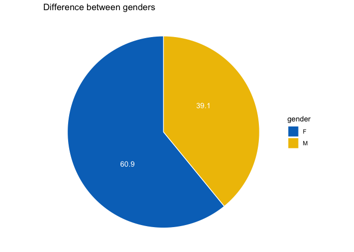
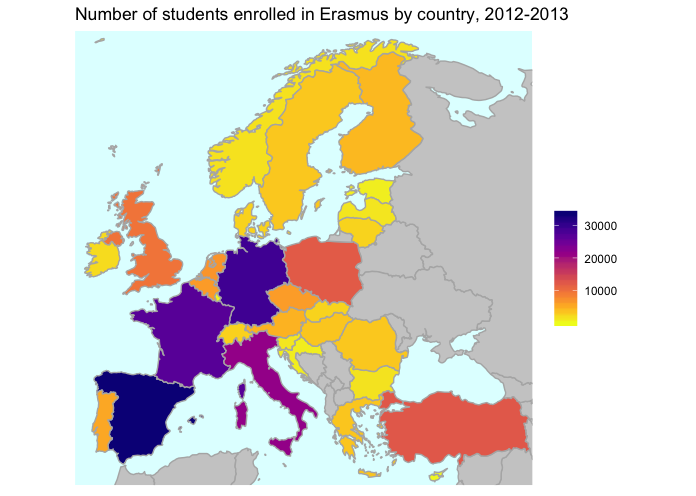

# Final Project - ERASMUS+ Mobility Program

# Abstract

# Introduction and related work
## Introduction
During winter semester of academic year 2019/2020 each member of our group was studying at Universidad Politécnica de Madrid through the Erasmus program. We had different choices for Erasmus destination but finally have met here in Madrid. Since we all had different reasons for applying to this University and choosing this city, we wanted to explore student's choices for Erasmus and their destinations. After searching the internet for some time we found out that European union publishes data including information about every student's exchange. Considering that this exchange is something we all have in common, we have decided to explore one of these datasets. The most interesting question that occurred to us is: **What is the most popular city or university for students in our area of study?** Then we can compare it to our own choice. We can also see how many people from our countries actually had the same choice as we did.

## Related work
* [Gender Gap in the ERASMUS Mobility Program](https://www.ncbi.nlm.nih.gov/pmc/articles/PMC4762674/)
* [Barriers to International Student Mobility Evidence From the Erasmus Program](https://www.researchgate.net/publication/258134759_Barriers_to_International_Student_Mobility_Evidence_From_the_Erasmus_Program)
* [Social and Economic Conditions of Student Life in Europe: Chapter 8. Internationalisation and student mobility](https://books.google.es/books?id=E5EBLiBIFrEC&pg=PA130&lpg=PA130&dq=student+mobility+dataset+project&source=bl&ots=L4hMMvLoUQ&sig=ACfU3U1Lx9TTlmDVVE2E6r6tOK1hGRMjrQ&hl=hr&sa=X&ved=2ahUKEwicj_X51dXlAhVNXRoKHfYtCooQ6AEwCXoECAoQAQ#v=onepage&q=student%20mobility%20dataset%20project&f=false)
* [Erasmus+ annual report 2017](https://op.europa.eu/en/publication-detail/-/publication/4e5c3e1c-1f0b-11e9-8d04-01aa75ed71a1)
* [Not only Erasmus. Where and why European students move abroad](https://www.europeandatajournalism.eu/eng/News/Data-news/Not-only-Erasmus.-Where-and-why-European-students-move-abroad)

# Exploratory Data Analysis

Dataset that we used is one from 2012-2013 academic year that can be found [here](https://data.europa.eu/euodp/en/data/dataset/erasmus-mobility-statistics-2012-13). Dataset is published directly by European Union. It was created from the statistical reports of the national agencies of the 33 countries participating in the Erasmus+ program (Erasmus decentralised actions) and data provided by Education Audiovisual and Culture Executive Agency (Erasmus centralised actions). The data is generated during the application process of the student and then collected by the respective universites. It contains 267547 observations and has 34 different variables.  
Host institution country is one of the most interesting variables to us and we can see that it has a lot of undefined values, around 55 thousand, so we need to filter those out. For both host and home country, values are coded as country codes. However Belgium is coded as three diferent values: "BEDE", "BEFR" and "BENL" depending on the language area (Dutch, France or German). We are going to merge all of this values to a single one for whole Belgium.  
There are 34 different vairables and we are not going to use all of them, so we list ones that are most relevant for our research:
* HOME_INSTITUTION_CTRY_CDE (home country code)
* STUDENT_GENDER_CDE (gender F/M)
* STUDENT_AGE_VALUE (age value)
* STUDENT_NATIONALITY_CDE (nationality code)
* STUDENT_STUDY_LEVEL_CDE (study level - 1/2/3/S)
* STUDENT_SUBJECT_AREA_VALUE (subject area code)
* HOST_INSTITUTION_COUNTRY_CDE (host country code)
* HOST_INSTITUTION_CDE (host institution code)
* LENGTH_PLACEMENT_VALUE (length in months)
* PLACEMENT_START_DATE (start date of exchange)
* ECTS_CREDITS_PLACEMENT_AMT (Number of ECTS credits enrolled during exchange)

First thing we wanted to explore is to see if there is a difference between number of male and females enrolled in Erasmus. We were expecting to see significant difference as one of the cited papers suggest that there is gender gap. Pie chart we presented here to confirm this assumption. 

Next we wanted to see what are the countries with most students goint to Erasmus. In order to not just list them, we decided to present this metric in a Europe map, coloring each country regarding the number of students with home university in that country. We can see that Spain, France and Germany are leading in students enrolled in Erasmus. Surprising thing is to see that Turkey lists very high.

